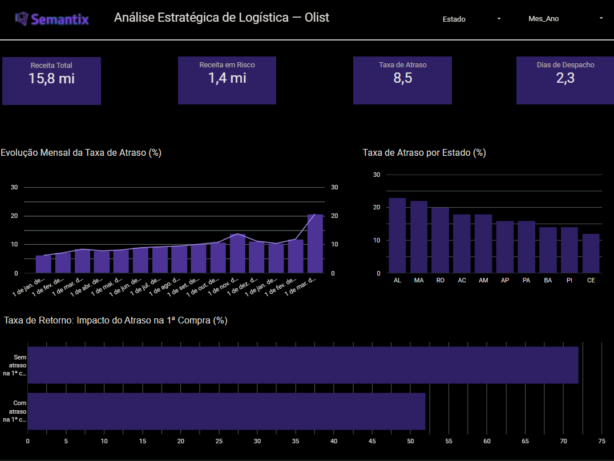
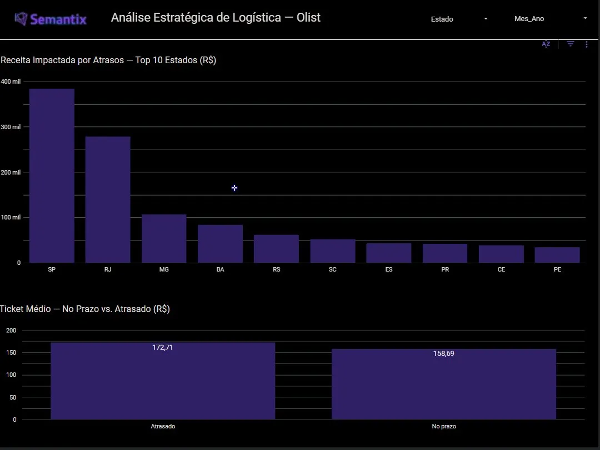

# Análise Estratégica de Logística — Olist 🚚

Projeto desenvolvido em parceria com a **Semantix**, investigando como atrasos na entrega afetam a receita e a fidelização de clientes no e-commerce brasileiro.

---

## Sumário

1. [O Problema](#o-problema)
2. [Por que isso importa](#por-que-isso-importa)
3. [Coleta de Dados](#coleta-de-dados)
4. [Modelagem e Análise](#modelagem-e-análise)
5. [O que encontramos](#o-que-encontramos)
6. [Dashboard](#dashboard)
7. [Conclusões](#conclusões)
8. [Como rodar o projeto](#como-rodar-o-projeto)

---

## O Problema

Entregar no prazo parece simples, mas no Brasil — com suas dimensões continentais e infraestrutura desigual — isso é um desafio real para qualquer e-commerce. A pergunta que guiou esse projeto foi:

> **Onde, quando e por que os pedidos atrasam? E qual é o custo disso para o negócio?**

Usando dados da Olist, analisamos pedidos reais feitos entre 2016 e 2018 para responder isso com dados — não com achismo.

---

## Por que isso importa

Atraso não é só inconveniente para o cliente, é prejuízo direto para o negócio:

- Clientes que têm uma má experiência na **primeira compra** raramente voltam.
- Os pedidos que mais atrasam tendem a ser justamente os de **maior valor**.
- Algumas regiões concentram o problema de forma desproporcional — o que indica que o gargalo tem padrão e tem solução.

---

## Coleta de Dados

Os dados vieram do dataset da Olist, disponível no Kaggle:

🔗 [Brazilian E-Commerce Public Dataset by Olist](https://www.kaggle.com/datasets/olistbr/brazilian-ecommerce)

Dados reais e anonimizados, com licença CC BY-NC-SA 4.0. Período: setembro de 2016 a outubro de 2018.

O projeto utilizou **3 arquivos CSV**:

| Arquivo | O que contém |
|---|---|
| `olist_customers_dataset.csv` | Estado e cidade de cada cliente |
| `olist_orders_dataset.csv` | Datas de compra, aprovação, despacho e entrega |
| `olist_order_items_dataset.csv` | Preço e frete por item de cada pedido |

Os arquivos foram carregados via `pandas.read_csv()`, com validação de nulos, tipos e consistência entre tabelas.

---

## Modelagem e Análise

### Tratamento dos dados

- Renomeação das colunas para português
- Conversão das colunas de data para `datetime`
- Filtragem apenas de pedidos com status `delivered`
- Merge entre as três tabelas por `order_id` e `customer_id`

### Variáveis criadas

| Variável | O que representa |
|---|---|
| `tempo_entrega_dias` | Dias entre compra e entrega real |
| `tempo_estimado_dias` | Dias entre compra e prazo prometido |
| `atrasado` | Flag: entregou depois do prometido? |
| `diferenca_prazo` | Quantos dias de diferença (positivo = atraso) |
| `receita_total` | Preço + frete por pedido |
| `mes_ano` | Período mensal para análise de sazonalidade |

### O que foi analisado

- Taxa geral de atraso na base
- Top 10 estados com maior incidência de atrasos
- Impacto financeiro: quanto da receita está vinculada a pedidos atrasados
- Ticket médio de pedidos no prazo vs. atrasados
- Sazonalidade mensal ao longo de 2017 e 2018
- Detecção de outliers de preço via método IQR e seu impacto logístico
- Tempo médio de aprovação e despacho (gargalos operacionais)
- Taxa de retorno de clientes que tiveram atraso na primeira compra

---

## O que encontramos

**8,53% dos pedidos chegaram atrasados** — quase 1 em cada 12.

**R$ 1,35 milhão em receita** está diretamente ligada a esses pedidos, de um total de R$ 15,82 milhões analisados.

**Alagoas lidera o ranking de atrasos com 23%**, seguida por MA, RO, AC e AM. O Norte e Nordeste concentram os piores índices — não por acaso, são as regiões mais distantes dos centros de distribuição.

**Março de 2018 foi o pior mês, com 20,7% de atrasos** — superando inclusive o pico da Black Friday (13,8%). Algo saiu do controle operacionalmente naquele período.

**Quem atrasa na primeira compra, não volta.** A taxa de retorno cai 20% quando o cliente tem um atraso logo no primeiro pedido.

**Os pedidos que atrasam são os mais caros.** Ticket médio dos atrasados: R$ 172,71 vs. R$ 158,69 dos no prazo. Os clientes mais valiosos estão sendo os mais prejudicados.

**Despacho demora 2,3 dias em média** entre aprovação do pagamento e envio ao transportador. Esse é um gargalo interno e controlável.

---

## Dashboard

Dashboard interativo desenvolvido no **Looker Studio** com duas páginas.

🔗 [Acessar o dashboard completo](https://datastudio.google.com/reporting/465991c2-4e21-4e44-8067-efa2f1b99d33)

---

### Página 1 — Visão Geral

> KPIs principais, evolução mensal da taxa de atraso, distribuição por estado e impacto na retenção de clientes.



**O que essa página mostra:**
- 4 scorecards com os KPIs principais (receita total, receita em risco, taxa de atraso, dias de despacho)
- Evolução mensal da taxa de atraso (2017–2018)
- Taxa de atraso por estado — top 10
- Taxa de retorno: impacto do atraso na 1ª compra

---

### Página 2 — Impacto Financeiro

> Receita comprometida por estado e comparativo de ticket médio entre pedidos no prazo e atrasados.



**O que essa página mostra:**
- Receita impactada por atrasos — top 10 estados (R$)
- Ticket médio comparativo: no prazo vs. atrasado

---

Filtros interativos por **Estado** e **Mês/Ano** disponíveis em ambas as páginas.

---

## Conclusões

O problema de atraso na Olist não é genérico — ele tem endereço, tem época e tem causa. Isso é boa notícia, porque significa que dá para atacar com precisão.

As três frentes mais urgentes:

**1. Rever os parceiros logísticos no Norte e Nordeste.** Uma taxa de 23% em Alagoas não é coincidência — é falha estrutural de cobertura regional.

**2. Cortar o tempo de despacho interno.** 2,3 dias entre aprovação e envio é muito. Automatizar esse passo reduz atrasos sem depender de transportadora.

**3. Proteger a primeira compra.** Se um pedido tem sinal de risco de atraso e é a primeira compra daquele cliente, vale qualquer esforço extra — o impacto na retenção justifica.

| Prioridade | Ação |
|---|---|
| 🔴 Alta | Revisar SLAs com transportadoras em AL, MA e RO |
| 🔴 Alta | Criar alerta para risco de atraso em primeiras compras |
| 🟡 Média | Automatizar o processo de despacho pós-aprovação |
| 🟡 Média | Reforçar capacidade logística em fevereiro/março |
| 🟢 Baixa | Política de compensação proativa para atrasos detectados |

---

## Como rodar o projeto

```bash
# Clone o repositório
git clone https://github.com/Bandeira1/Analise-Logistica-Olist.git
cd Analise-Logistica-Olist

# Instale as dependências
pip install pandas matplotlib seaborn

# Coloque os 3 CSVs da Olist na pasta Banco/ e rode
python analise_logistica_usuario.py
```

As visualizações serão salvas automaticamente na pasta `Graficos/`.

Para gerar os CSVs do Looker Studio:

```bash
python exportar_looker.py
```

Os arquivos serão salvos em `Banco/looker/`.

---

*Projeto desenvolvido em parceria com a Semantix — Data Analytics & Business Intelligence*
